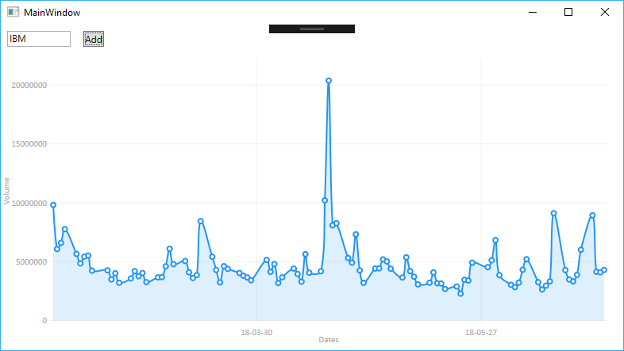
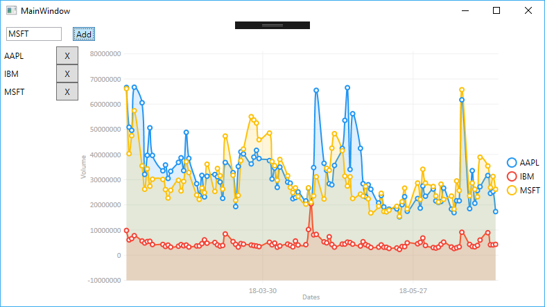
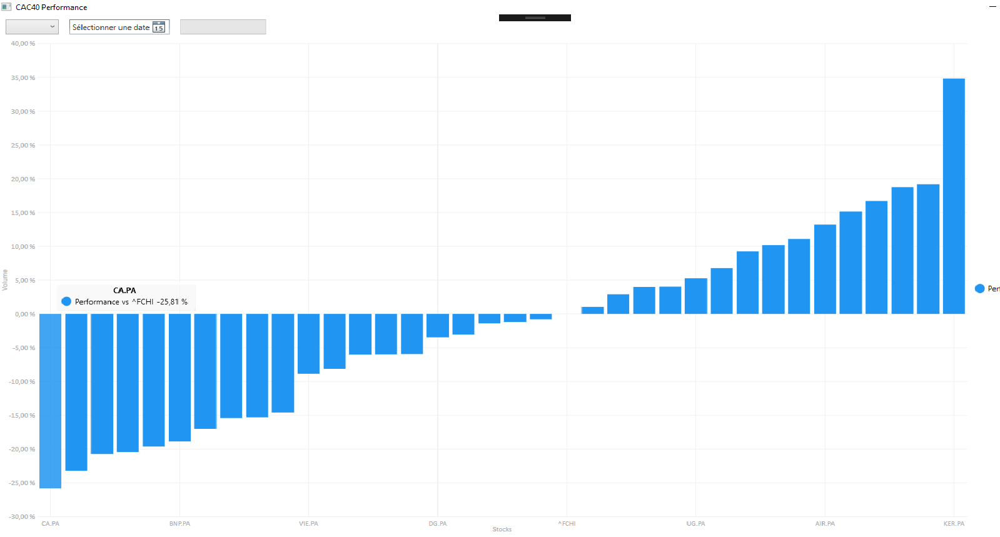

[](https://ci.appveyor.com/project/abdelkaderamar/av-net)

# AV.NET

AV.NET is a C# library for [AlphaVantage](https://www.alphavantage.co/) service.

# Features
Currently, the API includes the following features:
- Request daily data
- Request weekly data
- Request monthly data
- Request currency exchange rate (crypto/currency)

# Requirements
The project require Microsoft Visual Studio 2015 or 2017.

# Usage

The data can be retrieved using two methods:
1. Directly using one the available provider (`AvStockProvider` or `AvCurrencyProvider`). Because of the limitation on the number of the requests and their frequency, when this method is used, it is your responsability to manage the delay between requests.
2. Delegating the requests to one of the available request manager (`AvStockRequestManager` or `AvCurrencyRequestManager`).

## Direct request
Fist you need to create the data provider, for stock data it is `AvStockProvider` and for currencies data it is `AvCurrencyProvider`. The constructor needs your AlphaVantage key as an argument.

```csharp
AvStockProvider provider = new AvStockProvider(key);
```

Then you can call directly one of the available methods to retrieve the data

```csharp
// Download daily data from 2000 (second argument = true)
StockData sgoDailyData = provider.RequestDaily("SGO.PA", true);

// Download weekly data
StockData sgoWeeklyData = provider.RequestWeekly("SGO.PA");

// Download monthly data
StockData sgoMonthlyData = provider.requestMonthly("SGO.PA", true);

// Download batch data (available only for US stocks)
IDictionary<string, StockRealtime> batchData = provider.BatchRequest(new string[] { "MSFT", "IBM", "AAPL" });
```
When using this method, you need to handle the dely between successive requests and errors.


## Using `RequestManager`

The API provides types to manage the successive requests and the errors. Currently, two types are available:
- `AvStockRequestManager`: for stock requests
- `AvCurrencyRequestManager`: for currency requests

The following examples use the `AvStockRequestManager` but the same can be done with the other requests manager.

1. Creating the request manager
```csharp
AvStockRequestManager requestManager = new AvStockRequestManager(provider);
requestManager.Start();
```
2. Add a request
```csharp
requestManager.Add(StockRequestType.Daily, stock, Callback);
```
3. Processing the results
```csharp
private static void Callback(StockRequestType requestType, string symbol, StockData stockData)
{
    if (stockData == null)
    {
      Console.WriteLine("No {0} data received for symbol {1}", requestType.ToString(), symbol);
     }
     else
     {
         Console.WriteLine("Receiving {0} data for symbol {1}", requestType.ToString(), symbol);
         Console.WriteLine("\t{0} data", stockData.Data.Count);
         Console.WriteLine("\t{0}", stockData);
     }
}
```

### Customize request processing
The Request Manager has several properties and methods to control the processing of the requests

#### `Delay`
This property is used to set the delay in milliseconds between two successive requests.

#### `EnabledRetry`
When set to `true`, the request manager will retry to download data if high usage error is received from *AlphaVantage* server. When high usage error is received, the request manager increased the delay between the requests.

#### `MaxRetry`
This property define the maximum number of successive retry when hig usage error is received.  

#### Stopping the request manager
To stop the request manager thread, there is method `Stop`. If the argument `finish` is set to `true`, the request manager will process all the pending requests before effectively stop the thread.

# Samples

## Volume Chart
This program allows to input a stock and display the volume chart of last 100
trading days.



## Multiple Volume Chart
This program displays the volume chart of the last 100 trading days of one or
more stocks. The stocks can be added and removed dynamically.




## CAC40 performance
This program computes and displays the performance of the stocks of the CAC40 vs
the CAC40 perfomance for the last 100 trading days.



# License
MIT

# Open Source Components/Libraries
- [Json.NET](https://www.newtonsoft.com/json)
- [LiveCharts](https://lvcharts.net/)
- [log4net](https://logging.apache.org/log4net/)
